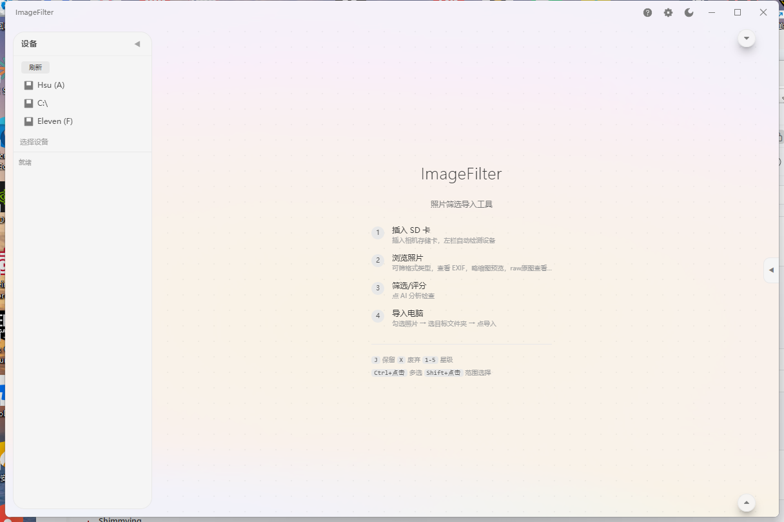

<p align="center">
  
</p>

<h1 align="center">ImageFilter</h1>

<p align="center">
  照片筛选导入工具 — 快速预览、筛选、导入，全程本地处理
</p>

<p align="center">
  <a href="https://github.com/XUTENGXIANG/ImageFilter/releases"></a>
  <a href="#"></a>
  <a href="LICENSE"></a>
  <a href="https://github.com/XUTENGXIANG/ImageFilter/releases/download/v1.0/ImageFilter_1.0.0_x64-setup.exe"></a>
</p>

<p align="center">
  <a href="https://tensyn.online/#download"></a>
  &nbsp;·&nbsp;
  <a href="README.en.md"></a>
</p>

---

## 简介

为摄影师打造的 RAW 初筛工作流 —— 插卡识别、秒级预览、星级筛选、AI 辅助、一键归档

- 缩略图网格预览，快速初筛，LrC 同款星级筛选
- 主流 RAW 格式原生支持，DNG 内置专用解码器
- 模糊 / 过曝 / 连拍重复自动检测，星级评分辅助筛选
- 命名规则自动归档，MD5 校验保证数据完整
- 所有处理在本地完成

---

> **开发状态**
> - 尚处于待完善阶段，欢迎提出想法与建议！
> - 由于缺乏构建环境，macOS 版可能存在显著问题，请谅解，欢迎提交 issues。
> - 感谢所有贡献者！

---

## 界面




双击照片打开全屏查看器：滚轮缩放、拖动平移、旋转，查看器中直接评分。界面支持深色 / 浅色主题、中英文切换、Windows Mica 毛玻璃背景。

## 安装

从 [Releases](https://github.com/XUTENGXIANG/ImageFilter/releases) 页面下载对应安装包：

| 文件 | 说明 |
|------|------|
| `ImageFilter_x64-setup.exe` | NSIS 安装包，推荐 |
| `ImageFilter_x64_zh-CN.msi` | MSI 安装包 |

双击运行，按提示完成安装。下载慢可用[官网](https://tensyn.online/#download)直链或 [Releases](https://github.com/XUTENGXIANG/ImageFilter/releases) 说明处下载；macOS 版请见 [Releases](https://github.com/XUTENGXIANG/ImageFilter/releases)。

## 快速上手

1. 将 SD 卡或相机连接到电脑，左侧自动识别设备
2. 点击设备，浏览文件夹，点进目标文件夹查看照片
3. 单击勾选照片（再点取消），`Shift` 点击范围连选
4. 底部选择导入目标文件夹，点击"导入"

### 快捷键

| 按键 | 功能 |
|------|------|
| `J` | 保留（3 星） |
| `X` | 废弃（0 星） |
| `1`–`5` | 星级评分 |
| `←` / `→` | 查看器切换照片 |
| `R` / `Shift+R` | 查看器旋转 |
| `0` | 查看器重置视图 |

### 命名规则

导入时可按模板自动组织文件：

- `{date}` — 拍摄日期（2026-08-10）
- `{camera}` — 相机型号（Sony_A7M4）
- `{seq}` — 序号（0001）
- `{original}` — 原文件名

示例：`{date}/{camera}/{seq}.{ext}` 生成 `2026-08-10/Sony_A7M4/0001.ARW`

## 技术栈

| 层 | 技术 |
|----|------|
| 框架 | Tauri 2, React 19, TypeScript |
| UI | Tailwind CSS 4, shadcn/ui, IconPark |
| RAW 解码 | rawler, WIC, tinydng, zune-jpeg |
| 缩略图 | Windows Shell（IShellItemImageFactory） |
| 图像分析 | imgfprint, 纯算法（拉普拉斯/直方图） |
| 存储 | SQLite |

## 开发

环境要求：Node.js 18+、Rust stable、MSVC Build Tools。

```bash
# 克隆仓库
git clone https://github.com/XUTENGXIANG/ImageFilter.git
cd ImageFilter

# 安装依赖
npm install

# 开发模式（热重载）
npx tauri dev

# 构建安装包
npx tauri build
```

构建产物输出到 `src-tauri/target/release/bundle/`。

## 项目结构

```
src/                  # React 前端
  App.tsx             # 主界面（三栏布局 + 浮窗工具条）
  useScanner.ts       # 状态管理与业务逻辑
  viewer.tsx          # 图片查看器（渐进加载）
  i18n/               # 中英文翻译（zh / en）
  components/         # 浮窗面板/工具条/照片卡片等组件
src-tauri/            # Rust 后端
  src/
    scanner/          # 设备/浏览/EXIF/图片解码模块
    analyzer.rs       # 模糊/曝光/重复检测
    importer.rs       # 导入引擎
    win_wic.rs        # Windows WIC 解码
    tinydng.rs        # DNG 解码（FFI）
  third_party/tinydng # DNG 解码器 C++ 源码
```
